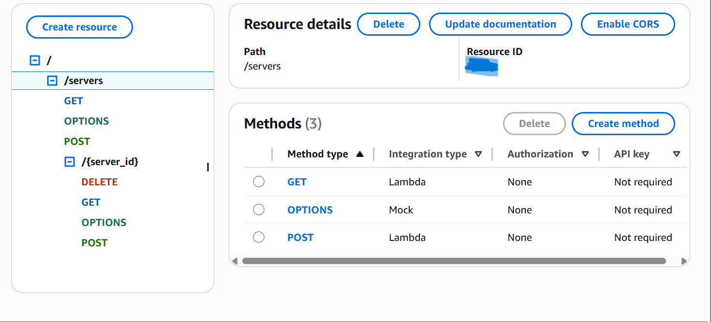
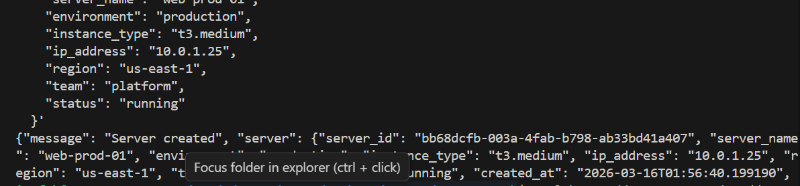
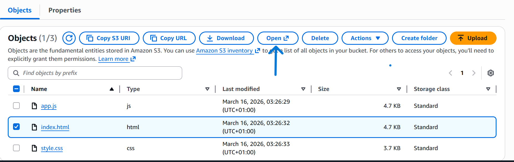
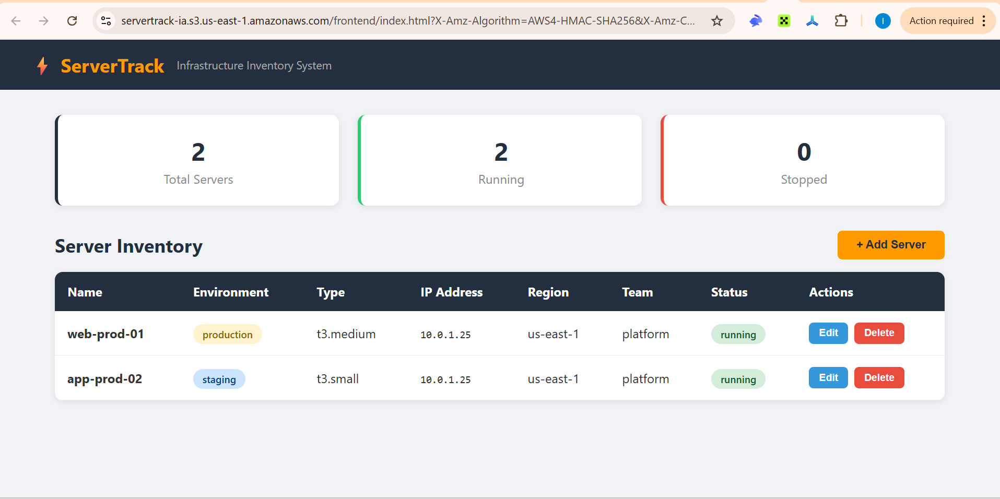
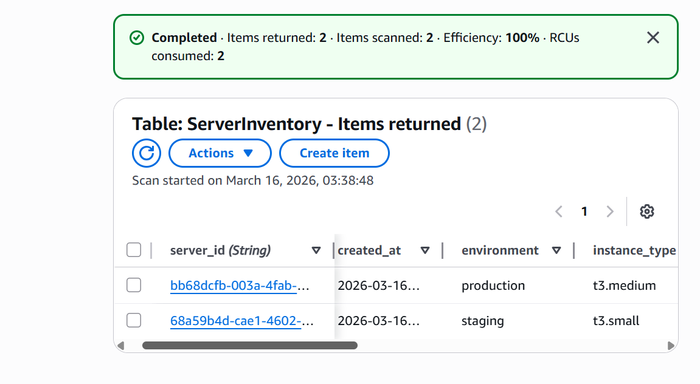
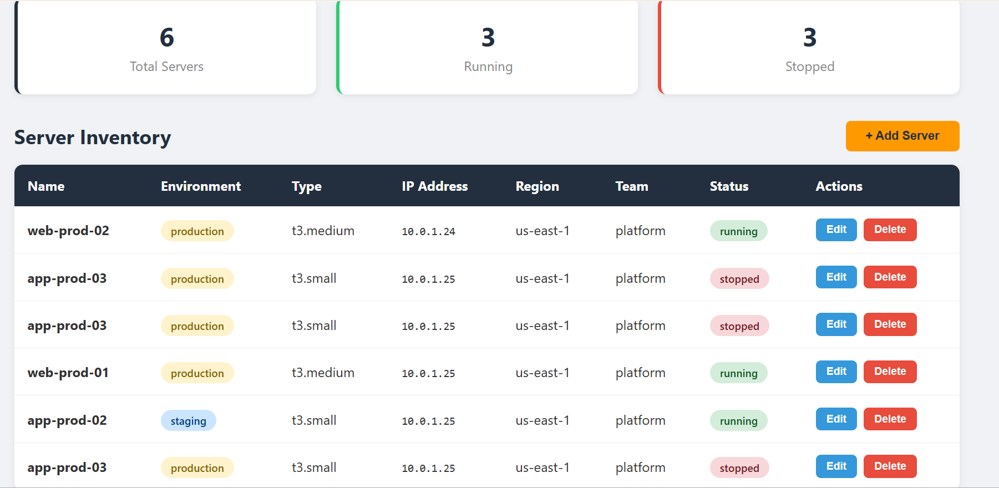
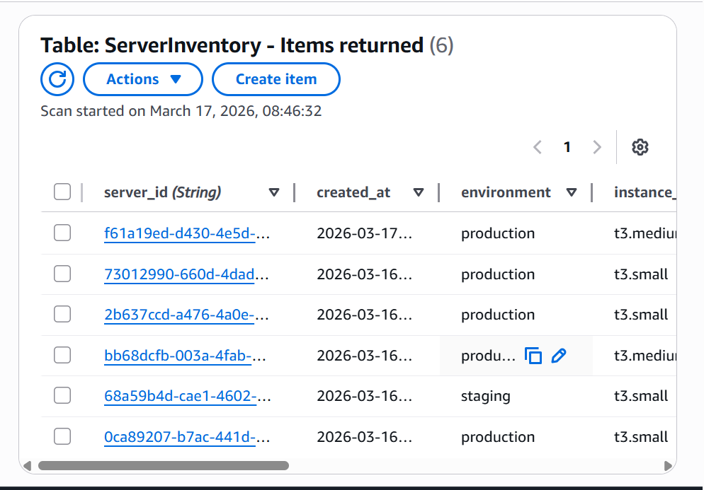

Here are the various steps you will take to get the application running by creating and linking up various AWS services
## Step 1 — Create the DynamoDB Table
1. Go to DynamoDB in the AWS Console
2. Click Create table
3. Fill in:

 * Table name: ServerInventory
 * Partition key: server_id (String)


4. Under Table settings, select Customize settings
5. Read/write capacity: On-demand (pay per request, no capacity planning needed)
6. Leave everything else as default
7. Click Create table
8. Wait until the status shows Active


## Step 2 - Create the IAM Role for Lambda
1. Go to IAM → Roles
2. Click Create role
3. Select AWS service, then select Lambda
4. Click Next
5. Attach these policies:

* Search and select AmazonDynamoDBFullAccess
* Search and select CloudWatchLogsFullAccess


6. Click Next
7. Role name: servertrack-lambda-role
8. Click Create role

## Step 3 - Create the Lambda Function
1. Go to Lambda → Create function
2. Fill in:

* Function name: servertrack-api
* Runtime: Python 3.12
* Architecture: x86_64
* Under Permissions, expand Change default execution role
* Select Use an existing role
* Choose servertrack-lambda-role


3. Click Create function
4. In the code editor, delete the default code and input the codes on lambda_function.py
5. Click Deploy
6. Under Configuration → General configuration, set Timeout to 30 seconds

## Step 4 - Create the API Gateway
1. Go to API Gateway
2. Click Create API
3. Under REST API, click Build
4. Fill in:

- API name: servertrack-api
- API endpoint type: Regional
5. Click Create API

### Create the /servers Resource

1. Click Create resource
2. Resource path: /
3. Resource name: servers
4. Enable CORS ✅
5. Click Create resource

### Create Methods on /servers
Select the /servers resource, then:
GET method:

1. Click Create method
2. Method type: GET
3. Integration type: Lambda Function
4. Lambda function: servertrack-api
5. Click Create method

### POST method:

1. Click Create method
2. Method type: POST
3. Integration type: Lambda Function
4. Lambda function: servertrack-api
5. Click Create method

### Create the /{server_id} Resource

1. Select the /servers resource
2. Click Create resource
3. Resource name: {server_id}
4. Resource path: {server_id}
5. Enable CORS ✅
6. Click Create resource

### Create Methods on /{server_id}
Select the /{server_id} resource, then create three methods:

GET, PUT, DELETE — each one with:

* Integration type: Lambda Function
* Lambda function: servertrack-api

### Deploy the API

1. Click Deploy API
2. Stage: New stage
3. Stage name: prod
4. Click Deploy
5. Copy the Invoke URL — it will look like:
https://xxxxxxxxxx.execute-api.us-east-1.amazonaws.com/prod

You will need this URL for the frontend.

Here is an overview of what your API page on AWS will look like


## Step 5 - Test the API
You can test directly from your terminal before building the frontend.

Create a server:
```
curl -X POST https://YOUR_API_URL/prod/servers \
  -H "Content-Type: application/json" \
  -d '{
    "server_name": "web-prod-01",
    "environment": "production",
    "instance_type": "t3.medium",
    "ip_address": "10.0.1.25",
    "region": "us-east-1",
    "team": "platform",
    "status": "running"
  }'

  # List all servers
  curl https://YOUR_API_URL/prod/servers
  ```
If both return valid JSON responses, your backend is working.
Image below shows that the API is working


## Step 6 - Host the frontend on S3
Ensure the files on the frontend folder are on your local machine. The app.js file has a placeholder link that ought to be your API Gateway URL, replace it with your URL for the connection to be successful
1. Go to S3 in the console
2. Click Create bucket
3. Bucket name: servertrack-frontend-YOURINITIALS (must be globally unique)
4. Region: same as your other services
5. Uncheck Block all public access
6. Acknowledge the warning
7. Click Create bucket

Enable Static Website Hosting

1. Go into your bucket
2. Click the Properties tab
3. Scroll to Static website hosting and click Edit
4. Select Enable
5. Index document: index.html
6. Click Save changes

Add a Bucket Policy for Public Read Access

1. Click the Permissions tab
2. Under Bucket policy, click Edit
3. Paste this policy (replace YOUR-BUCKET-NAME):
```
{
    "Version": "2012-10-17",
    "Statement": [
        {
            "Sid": "PublicReadGetObject",
            "Effect": "Allow",
            "Principal": "*",
            "Action": "s3:GetObject",
            "Resource": "arn:aws:s3:::YOUR-BUCKET-NAME/*"
        }
    ]
}
```
4. Click Save changes

Upload the Frontend Files

1. Click the Objects tab
2. Click Upload
3. Upload all three files: index.html, style.css, app.js
4. Click Upload

Get Your Website URL
Go back to Properties → Static website hosting. Copy the Bucket website endpoint. It will look like:

http://servertrack-frontend-YOURINITIALS.s3-website-us-east-1.amazonaws.com
You could simply go from here based on the photo below


Open it in your browser and your dashboard should load.

Your web-url will look like this


This is how your data on dynamodb will look like


You can decide to populate the database by adding more data to the frontend


Confirm again at dynamodb on AWS


